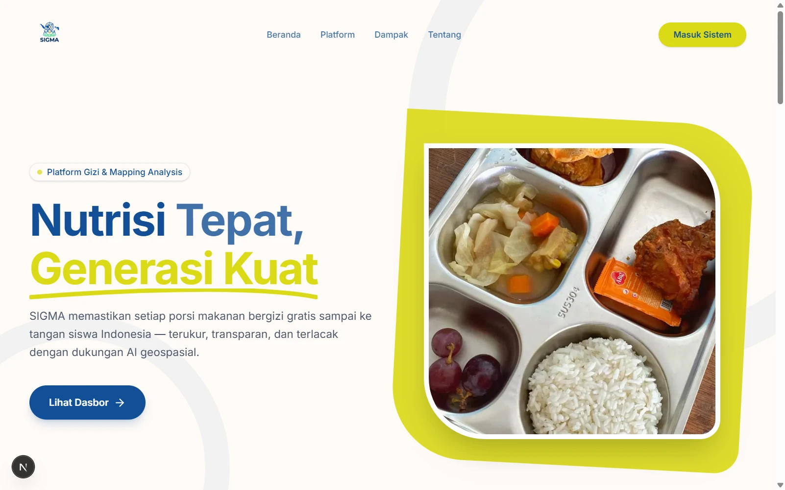
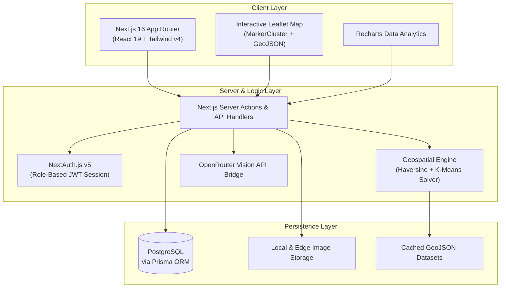

# SIGMA — Strategic Intelligence for Gizi & Mapping Analysis

[](#tech-stack)
[](#tech-stack)
[](#tech-stack)
[](#tech-stack)
[](#tech-stack)
[](#tech-stack)
[](#geospatial-engine)
[](#ai-meal-scanner)

> **AI-Powered Geospatial Platform for National Free Nutritious Meal (MBG) Kitchen Placement, Distribution Logistics, and Food Quality Assurance.**

Developed for **IN:NOVATE – CodeUp! 2026** Hackathon (Politeknik Astra) under the theme *"One Earth, One Daye, Infinite Solutions"*, supporting **UN SDGs 2 (Zero Hunger)**, **SDG 3 (Good Health and Well-Being)**, and **SDG 11 (Sustainable Cities and Communities)**.



---

## Table of Contents

- [The Challenge](#the-challenge)
- [The Solution](#the-solution)
- [Core Pillars](#core-pillars)
  - [1. Geospatial Clustering & Proximity Engine](#1-geospatial-clustering--proximity-engine)
  - [2. Multi-Role Operational Dashboards](#2-multi-role-operational-dashboards)
  - [3. AI Vision Meal Quality Scanner](#3-ai-vision-meal-quality-scanner)
- [System Architecture](#system-architecture)
- [Database Schema](#database-schema)
- [Project Structure](#project-structure)
- [Tech Stack](#tech-stack)
- [Team & Acknowledgments](#team--acknowledgments)

---

## The Challenge

Indonesia's **Program Makan Bergizi Gratis (MBG)** is a massive national initiative targeting tens of millions of students. However, executing this at national scale creates major operational bottlenecks:

1. **Suboptimal Kitchen Placements**: Satuan Pelayanan Pemenuhan Gizi (SPPG / Central Kitchens) are often situated too far from target schools (>6 km), causing transit delays, spoilage, and cold food delivery.
2. **Distribution Blind Spots**: Regional governments lack unified real-time visibility over which schools are actively covered and which remain unserved.
3. **Food Safety & Quality Inconsistencies**: No standardized, accessible mechanism exists for students and schools to verify nutritional completeness or report spoiled rations with instant validation.

---

## The Solution

**SIGMA** (*Strategic Intelligence for Gizi & Mapping Analysis*) bridges data, machine learning, and multi-role operations into a single cohesive platform. 

By combining **K-Means Clustering** on over 200,000 national school coordinates with real-time **Haversine geospatial calculations**, SIGMA identifies optimal kitchen locations, detects high-risk distribution gaps, automates kitchen licensing workflows, and enables students to conduct computer-vision nutrition audits right from their cafeteria trays.

---

## Core Pillars

### 1. Geospatial Clustering & Proximity Engine

```
[ 200K+ National Schools ] ──► [ K-Means Clustering ] ──► [ Centroid Candidates ]
                                       │
                                       ▼
  [ Kitchen Proximity Evaluation (Haversine Distance Matrix) ]
    ├─ Safe Zone (≤ 3 km)      ──► Direct Approval Recommended
    ├─ Moderate Zone (3 - 6 km) ──► Review Required
    └─ At Risk Zone (> 6 km)    ──► Out-of-Range Alert / Rejection
```

- **Interactive GIS Map**: Visualizes nationwide school densities, active SPPG kitchens, and recommended candidate clusters using Leaflet and MarkerCluster with province-level filtering.
- **K-Means Recommendation**: Automatically computes geographic centroids based on school population clusters to propose new SPPG construction sites.
- **Proximity Matrix**: Automatically scores all kitchen-to-school distances using Haversine formulas against the strict 6 km maximum operational threshold defined in logistics requirements.

---

### 2. Multi-Role Operational Dashboards

SIGMA provides three purpose-built experiences tailored to each stakeholder in the MBG supply chain:

| Role | Target User | Key Capabilities |
|---|---|---|
| **Pemerintah** | Government Officials & Dinas Kesehatan | Interactive nationwide GIS map, automated kitchen proposal approvals/rejections, macro coverage analytics via Recharts, student complaint oversight, and nutrition education management. |
| **Dapur / SPPG** | Kitchen Operators & Caterers | Automated proximity-checked kitchen location submissions, daily portion output tracking, target school roster management, and complaint resolution tracking. |
| **Siswa** | Students & School Beneficiaries | Daily delivery schedule tracking, grievance reporting with photo uploads, nutritional education articles, and instant AI meal scanning. |

---

### 3. AI Vision Meal Quality Scanner

Students can photograph their daily meal tray directly through the dashboard. The image is processed through multimodal vision models via OpenRouter (e.g., Gemini Vision) to produce an instant nutrition and safety audit:

- **Nutritional Balance Assessment**: Automatically breaks down detected portions into Carbohydrates, Proteins, Vegetables, and Fruits.
- **Condition Classification**:
  - `Bergizi` (Healthy & Compliant): Meets nutritional baseline.
  - `Kurang Layak` (Substandard): Missing core nutrients or insufficient portions.
  - `Berbahaya` (Unsafe): Visible spoilage, undercooking, or contaminants.
- **Actionable Advice**: Immediate feedback for the student and automatic incident logging if a meal is flagged as substandard.

---

## System Architecture



---

## Database Schema

SIGMA's relational model is designed in PostgreSQL using Prisma ORM:

- **User**: Authentication, role assignment (`SISWA`, `SPPG`, `PEMERINTAH`), and profile metadata.
- **Sekolah**: Comprehensive national school records (name, province, district, student count, coordinates).
- **SPPG**: Central kitchen entities with capacity, operational status (`PENDING`, `AKTIF`, `DITOLAK`), and geospatial coordinates.
- **Distribusi**: Daily operational records linking SPPG kitchens to schools (portion count, delivery date, status).
- **Laporan**: Citizen complaint and feedback system with photo attachments, categorization, and resolution status.
- **ScanMakanan**: Historical records of AI vision meal audits (photo URL, nutrition status, detected components, recommendations).
- **Edukasi**: Nutritional guidelines, healthy habit articles, and educational content.

---

## Project Structure

```
sigma/
├── prisma/
│   ├── schema.prisma          # PostgreSQL relational schema definition
│   └── seed.ts                # Database seeder with sample schools & accounts
├── public/
│   ├── logosigma.png          # Official SIGMA brand asset
│   ├── sigma-preview.webp     # UI preview screenshot
│   └── uploads/               # Sandboxed user upload directory
├── src/
│   ├── app/
│   │   ├── (auth)/            # Authentication routes (login, register)
│   │   ├── actions/           # Next.js Server Actions (auth, sppg, siswa, pemerintah)
│   │   ├── api/               # API endpoints (GeoJSON providers, file uploads)
│   │   ├── dashboard/
│   │   │   ├── pemerintah/    # Government dashboard, GIS map, and approvals
│   │   │   ├── siswa/         # Student portal, complaint filing, AI scan
│   │   │   └── sppg/          # SPPG kitchen operations & distribution logs
│   │   ├── globals.css        # Tailwind CSS v4 styling & theme tokens
│   │   └── page.tsx           # Public landing page showcase
│   ├── components/
│   │   ├── map/               # Leaflet GIS client components
│   │   ├── shared/            # Reusable role sidebars & navigation
│   │   └── ui/                # Accessible design system (shadcn/ui base)
│   ├── lib/
│   │   ├── auth.ts            # NextAuth configuration & credentials provider
│   │   ├── constants.ts       # Application thresholds & configuration
│   │   └── prisma.ts          # Singleton Prisma Client connection
│   └── types/                 # Shared TypeScript interfaces & declarations
└── README.md
```

---

## Tech Stack

| Category | Technology | Purpose |
|---|---|---|
| **Framework** | Next.js 16 (App Router, Turbopack) | Server-rendered pages, Server Actions, and API routes |
| **Frontend UI** | React 19, Tailwind CSS v4 | Component architecture and modern responsive styling |
| **Component System**| Radix UI / shadcn/ui | Accessible, modular UI primitives |
| **Geospatial & Mapping** | Leaflet.js, React-Leaflet, MarkerCluster | High-performance visualization of 200,000+ points |
| **Data Analytics** | Recharts | Distribution metrics, risk ratios, and coverage charts |
| **Database & ORM** | PostgreSQL, Prisma ORM 7 | Relational persistence with connection pooling |
| **Authentication** | NextAuth.js v5 (Auth.js) | JWT session management with multi-role access control |
| **Artificial Intelligence** | OpenRouter (Multimodal Vision LLMs) | Real-time meal inspection and nutritional grading |
| **Runtime & Tooling** | TypeScript 5, Bun / Node.js 20+ | End-to-end type safety and rapid script execution |

---

## Team & Acknowledgments

SIGMA was built by **Team Raja Iblis** representing **S1 Terapan Sistem Informasi Kota Cerdas, Fakultas Ilmu Terapan, Universitas Telkom** for the **IN:NOVATE – CodeUp! 2026** competition:

- **Ghazy Nabil Alghifari** — Full-Stack Developer (Architecture, Frontend, Backend, Geospatial Integration)
- **Muhammad Haikal** — Machine Learning & Data Modeling
- **Dava Nur Khalik Ilham** — UI/UX Design & Quality Assurance

*Special thanks to Politeknik Astra and the IN:NOVATE 2026 committee for providing the platform to build meaningful civic tech solutions.*
